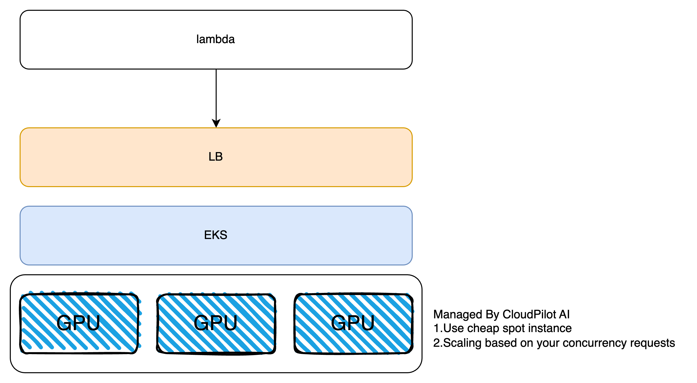

# gpu-infra-demo

In this tourial, we will show you how to use CloudPilot AI to build a GPU cluster.

The overview of the architecture is as follows:


With this arch, customer will only manage the following resources:
1.One yaml to deploy their service.
2.Several kubectl command operations, like kubetl get xxx.
3.Upgrade EKS clusters periodically.

## 1. Create EKS

Create EKS, please refer to: https://github.com/cloudpilot-ai/examples/tree/main/clusters/eks-spot

## 2. Install Knative Serving

Install CRD:
```
kubectl apply -f https://github.com/knative/serving/releases/download/knative-v1.17.0/serving-crds.yaml
```

Install components:
```
kubectl apply -f https://github.com/knative/serving/releases/download/knative-v1.17.0/serving-core.yaml
```

Install gateway:
```
kubectl apply -f config/kourier.yaml

kubectl patch configmap/config-network \
  --namespace knative-serving \
  --type merge \
  --patch '{"data":{"ingress-class":"kourier.ingress.networking.knative.dev"}}'

kubectl apply -f https://github.com/knative/serving/releases/download/knative-v1.17.0/serving-default-domain.yaml
```

Scale up corresponding components:
```
kubectl scale deployment activator --replicas=2 -n knative-serving
kubectl scale deployment webhook --replicas=2 -n knative-serving
kubectl scale deployment 3scale-kourier-gateway --replicas=2 -n kourier-system
```

Modify PDB:
```
kubectl patch pdb activator-pdb -n knative-serving --type='merge' -p '{"spec":{"minAvailable":1}}'
kubectl patch pdb webhook-pdb -n knative-serving --type='merge' -p '{"spec":{"minAvailable":1}}'
kubectl patch pdb 3scale-kourier-gateway-pdb -n kourier-system --type='merge' -p '{"spec":{"minAvailable":1}}'
```

Enable init container feature:
https://knative.dev/docs/serving/configuration/feature-flags/#kubernetes-init-containers

## 3. Install GPU device plugin

Install device plugin:
```
kubectl create -f https://raw.githubusercontent.com/NVIDIA/k8s-device-plugin/v0.15.0/deployments/static/nvidia-device-plugin.yml
```

## 4. Install CloudPilot AI

Install CloudPilot AI through https://console.cloudpilot.ai.

After install, run the following command:
```
kubectl get nodes -o name | xargs kubectl annotate karpenter.sh/do-not-disrupt=true
```

## 5. Create a AWS lambda function

Please change the url and Host headers to your own.
```python
import json
import urllib.request

def lambda_handler(event, context):
    # 需要请求的 URL
    url = "http://internal-ae48aac079eaf4d8585ffc4b3e9dda13-1325595810.us-east-2.elb.amazonaws.com"  # 这里替换成你要访问的 URL

    # 自定义 HTTP 头，包括 Host 头
    headers = {
        "Host": "hello.default.10.0.47.126.sslip.io",  # 这里替换成你要访问的 Host
        "User-Agent": "AWS Lambda Python",
        "Accept": "application/json"
    }

    req = urllib.request.Request(url, headers=headers)
    
    with urllib.request.urlopen(req, timeout=5) as response:
        body = response.read().decode("utf-8")
        return {
            'statusCode': response.getcode(),
            'body': body
        }
```

## 6.Deploy your service

Modify `config/helloworld.yaml` and apply it:
```
kubectl apply -f config/helloworld.yaml
```